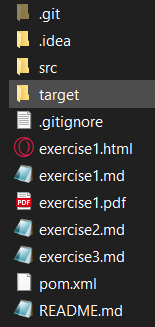

# Exercise 3

Ich hatte bereit die JDK 17 auf meinem Laptop installiert. Also habe ich  Installation von Maven begonnen.\
Dazu habe ich, vom in der Angabe enthaltenen Link, einen .zip-Ordner von Maven heruntergeladen.\

Im gedownloadeten .zip-Ordner habe ich, um Maven richtig zu installieren, die README abgearbeitet:
1. Den zip-Ordner in C:/Programme entzippt
2. Die Systemvariablen bearbeitet, d.h. ich habe zur PATH-Variable den Pfad zum Maven Ordner angegeben. Wichtig hierbei ist es, `\bin` anzuhängen.
3. Danach konnte mit den folgenden Befehlen überprüft werden, ob sowohl Maven als auch Java richtig installiert ist.\
`mvn -v`\
`java -version`\
`javac -version`\

Nun war alles soweit korrekt installiert und ich konnte mit dem Erstellen eines Java-Projektes beginnen.\
Dazu habe ich in Intellij ein neues Maven-Projekt in den Ordner, der in der letzten Übung mit `git clone` erstellt wurde, erstellt.\
Da durch diese Erstellung auch ein .idea-Ordner erzeugt wurde, wurde dieser zu der .gitignore-Datei hinzugefügt.

Danach habe ich für die Versionisierung mit `git status` überprüft, welche Dateien noch nicht behandelt wurden.\
Als nächster Schritt wurde die erste Versionisierung durchgeführt.
- `git add .gitignore`
- `git commit -m "added .idea to gitignore`
- `git add exercise3.md pom.xml`
- `git commit -m "added exercise3.md and pom.xml`

In IntelliJ wurden dann die Klassen Calculator und Main erstellt.\
Die Package-Struktur war wie folgt aufgebaut:\
at.campus02.bsd.Calculator\
at.campus02.bsd.Main

Calculator enthält alle Methoden für die Grundrechnungsarten inkl. Exception-Handling für Divisionen durch 0.

Main ruft alle Methoden aus und gibt die Ergebnisse aus.

Nach dem ersten Ausführen des Programmes wurde ein neuer Ordner erstellt: target\
Dieser Ordner enthält die Package-Struktur vom Java-Projekt (at.campus02...)\


Danach wurde folgender Block in die pom.xml eingefügt:\
```
<build>
        <plugins>
            <plugin>
                <groupId>org.apache.maven.plugins</groupId>
                <artifactId>maven-compiler-plugin</artifactId>
                <version>3.8.0</version>
                <configuration>
                    <release>17</release>
                </configuration>
            </plugin>
        </plugins>
    </build>
```
Nun wurde das Projekt mithilfe des Befehls `mvn compile` in der Konsole (direkt in IntellJ) gebuildet.


---

---
Links:\
[README (Start)](/README.md)