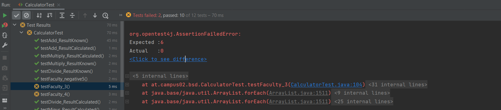

# Exercise 4

Jede Methode der Klasse `Calculator` wird zwei Mal getestet.\
1. Mit "fertigem" Ergebnis ( 5 + 3 = 8 )
2. Mit Rechenoperation ( `double result = 5 + 3;` )

Diese wurden mithilfe des Methoden-Namens `testXXX_ResultKnown` bzw. `testXXX_ResultCalculated` gekenntzeichnet.

_Zur Veranschaulichung wird bei jener Variante, bei der das Ergebnis bereits "bekannt" ist, dieses auch mitangeschrieben._

## Add
- 5 + 3 = 8
- 12 + 5 

## Minus
- 20 - 15 = 5
- 43 - 16 

## Divide
- 100 / 2 = 50
- 75 / 4 

## Multiply
- 4 * 5 = 20
- 12 * 3 

---

## Sonderfall - Division durch 0
Dieser Fall wurde als `testDivide_DivideByZero()` getestet.\
Hierbei wurde die Methode `Assertions.assertThrows(...)` verwendet.\
Erwartet wird eine `ArithmeticException`.

---
## Testcoverage

---
## Fakultät
Diese Tests sind nicht erfolgreich, da die Methode zu diesem Zeitpunkt noch nicht implementiert wurde.

---
Links:\
[README (Start)](/README.md)
