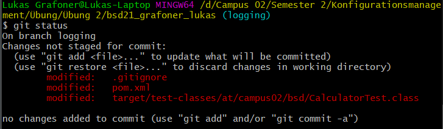
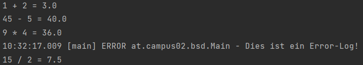
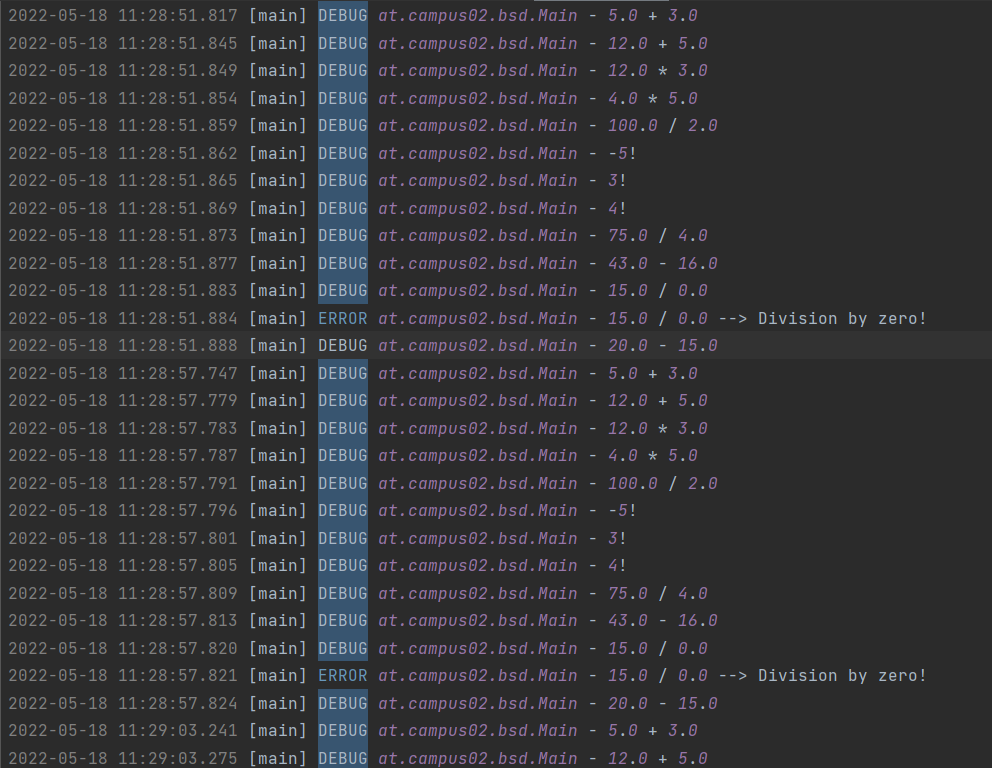

# Exercise 5

`git status` nach Erzeugung des Branches "logging", sowie ist eine Änderung der .gitignore- und pom-Datei ersichtlich. 


---

Output nach Einfügen des Loggers.\
Es wurde sowohl eine `INFO` als auch eine `ERROR` Log-Message hinzugefügt.\
Da es sich bei der ersten Nachricht (nach der Addition) jedoch um die Info-Message handelt, wird diese nicht ausgegeben.


---

Log-Datei


---

## Warum werden Logging Bibliotheken verwendet?
Um den Ablauf eines Programmes "besser" nachverfolgen zu können.\
Man sieht auf einen Blick schneller, wo es zu unerwünschten Ergebnissen oder sogar Fehlern kommt.\
Sie werden außerdem verwendet, damit man keine "normalen" Print-Aufrufe im Code hat, deren Zweck nur die Überprüfung ist.\
Außerdem kann man Log-Nachrichten auch einfach in ein eigenes Log-File schreiben.\
Um diese Vorgehensweise implementieren zu können, gibt es eigene Logging-Libraries.

---

## Welche Loglevel gibt es in Log4J und was hat es damit auf sich?
Loglevel bilden Kategorien ab. Dadurch kann man den Schweregrad eines Ereignisses/Events bestimmen.\
In Log4J gibt es folgende Loglevel (aufsteigend nach Schweregrad):
1. `ALL`: Alle Meldungen ausgeben
2. `TRACE`: Ausführlicheres Debugging (mit Kommentaren)
3. `DEBUG`: Debugging/Fehler finden
4. `INFO`: Information, z.B. "Programm gestartet", etc.
5. `WARN`: Warnung, als Information, dass etwas zu einem Fehler führen könnte
6. `ERROR`: Fehler, der abgefangen werden konnte - Programm läuft weiter
7. `FATAL`: Kritischer Fehler - Programmabbruch
- (`OFF`): Logging deaktiviert

---

## Was für Konfigurationsmöglichkeiten bietet Log4J?
__Console__\
Hierbei erstellt man, z.B. in der Main-Methode, ein Logger-Objekt und benutzt dieses, um die Log-Nachrichten zu schreiben.\
Diese werden dann auf der Konsole zwischen den anderen Ausgaben geprintet.\
```java
...
main(...)
{
    Logger log = LogManager.getLogger();
    log.info("Das ist eine Info :)");
}
```

__Console Appender mit XML Config File__\
Bei dieser Variante wird eine XML Datei erstellt, welche folgende Teile beinhalten muss:\
- Appender: Wohin die Logs geschrieben werden sollen (es kann auch mehrere Appender geben)
- Loggers: Was geloggt werden soll\

Man kann ein Pattern bestimmen (`PatternLayout`).\

In diesem Fall werden die Error-Logs auf der Console (`SYSTEM_OUT`) ausgegeben.
```xml
<?xml version="1.0" encoding="UTF-8"?>
<Configuration status="WARN">
  <Appenders>
    <Console name="Console" target="SYSTEM_OUT">
      <PatternLayout pattern="%d{HH:mm:ss.SSS} [%t] %-5level %logger{36} - %msg%n"/>
    </Console>
  </Appenders>
  <Loggers>
    <Root level="error">
      <AppenderRef ref="Console"/>
    </Root>
  </Loggers>
</Configuration>
```

__Externe Datei mit XML Config File von Log4J__\
In diesem Fall wird erneut eine XML Datei erstellt.\

Hier werden die Logs in die Datei `myLogs.log` im Ordner `logs` gespeichert.

```xml
<?xml version="1.0" encoding="UTF-8"?>
<Configuration status="warn" name="MyApp" packages="">
  <Appenders>
    <File name="MyFile" fileName="logs/myLogs.log">
      <PatternLayout>
        <Pattern>%d{HH:mm:ss.SSS} [%t] %-5level %logger{36} - %msg%n</Pattern>
      </PatternLayout>
    </File>
  </Appenders>
  <Loggers>
    <Root level="trace">
      <AppenderRef ref="MyFile"/>
    </Root>
  </Loggers>
</Configuration>
```

---
Links:\
[README (Start)](/README.md)
