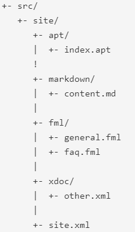
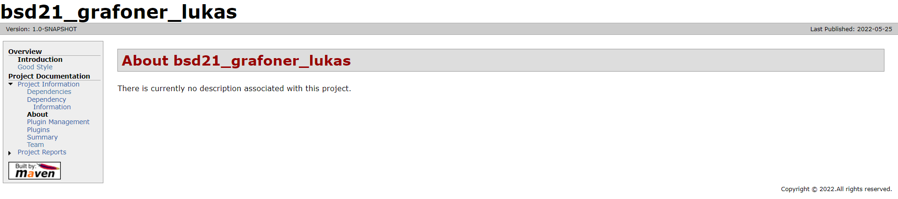
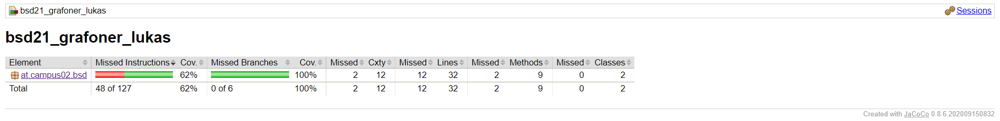

# Exercise 6

## Was ist notwendig um Maven Site Dokumentation zu generieren?
Man braucht einerseits folgende Ordner-Struktur, andererseits muss man alle notwendigen Dependencies zur pom.xml hinzufügen.\

## Welche unterschiedlichen Aspekte, Konfigurationen, Informationen, usw. werden in site.xml bzw. pom.xml konfiguriert?
Die pom.xml enthält Konfigurationen für das Projekt - Dependencies, Build, Plugins, etc.\
Die site.xml wird verwendet, um die Seite für das Projekt zu erstellen, 

---

## Seite des Projekts

---

## Javadoc Einbindung

---

## JUnit Testauswertung via JaCoCo

---
Links:\
[README (Start)](/README.md)
